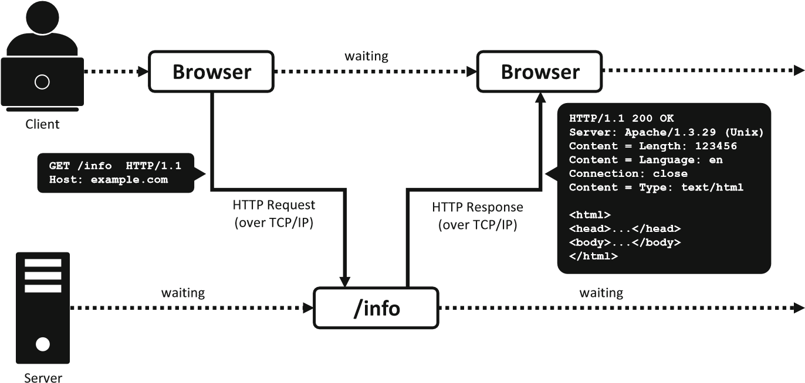
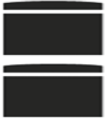

Chapter 6

Web Services

Abstract
========

Based on the client-server principle, Web services are software systems that
interact with client applications and other services through open Web standards.
Consequently, heterogenous computer systems from all over the world can exchange
information, regardless of their hardware configurations, operating systems, and
software applications. Web services are, therefore, a very popular approach for
facilitating automated intra-organizational and inter-organizational
communication. This chapter provides a thorough introduction to the Web service
concept and the different associated standards and technologies, such as Simple
Object Access Protocol (SOAP), RESTful interfaces, and Web Services Description
Language (WSDL). This chapter particularly provides a comprehensive introduction
for two important Web technologies on which most Web services are based: The
Hypertext Transfer Protocol (HTTP) and the Extensible Markup Language (XML).
Then, the fundamental Web service architectural principles are explained and two
common Web service variants are explored in more detail, namely RESTful and
SOAP-based Web services. Using these example implementations, this chapter
concludes by comparing the two Web service variants in terms of their different
application areas.

Learning Objectives of this Chapter
===================================

This chapter's main learning objective is to help readers understand the Web
service concept from different perspectives. Once readers have studied this
chapter, they will know, from an application perspective, which purposes Web
services serve and how Web services facilitate system integration efforts within
and between separate organizations. Moreover, this chapter conveys the
differences between the two major Web service variants, namely SOAP-based Web
services and RESTful Web services. Consequently, readers can make informed
choices about the Web service variant best suited for their particular use case.
From a technical perspective, this chapter's learning goal is to help readers
understand the general architecture behind Web services and how this
architecture functions. Having read this chapter, readers should have a
comprehensive knowledge of the two most important technologies on which Web
services are built: the Hypertext Transfer Protocol (HTTP) and the Extensible
Markup Language (XML). Furthermore, readers will understand how

© Springer Nature Switzerland AG 2020 155

A. Sunyaev, Internet Computing, https://doi.org/10.1007/978-3-030-34957-8_6

RESTful and SOAP-based Web services define and propagate their service offerings
and how service consumers can communicate with them.

Structure of this Chapter
=========================

This chapter about Web services is structured as follows: The first section
introduces the fundamentals of the Web service concept, including its use in
business-tobusiness integration. The second section provides a comprehensive
introduction for the two most important technologies that most Web services
currently utilize: the Hypertext Transfer Protocol (HTTP) and the Extensible
Markup Language (XML). The final section addresses the Web service architecture,
including the service-oriented architecture design paradigm, as well as internal
and external Web service architectures. In closing, the two most common
implementations of Web services, namely SOAP-based and RESTful Web services, are
closely examined and compared.

6.1 Introduction to Web Services
================================

Web services are software systems that interact with client applications and
other services via open standards in order to exchange data. These interactions
are based on the client-server principle. The Web service, acting as a server,
provides its clients with functionalities (e.g., access to resources and
processing operations) in the form of modular encapsulated services. Web
services make these functionalities available and discoverable through
propagation mechanisms, which usually take the form of machine-readable
documents that describe all operations exposed by the service. However, despite
its name, a Web service can be deployed on any network infrastructure, not only
on the World Wide Web (WWW). Web services are characterized by their high
interoperability and extensibility, which is achieved by applying standardized
Web technologies like the Extensible Markup Language (XML) and the Hyper Text
Transfer Protocol (HTTP). Leveraging these well-established technologies reduces
dependencies on proprietary networks, operating systems, and platforms, thus
making Web services ideal for connecting software applications that run on a
variety of platforms and frameworks (W3C 2004). Furthermore, multiple Web
services can be loosely coupled. Consequently, each Web service is easily
replaceable, as the old and new services provide interfaces that are built
around the same standardizes Web technologies. Hence, it is not unusual that
several simple services are chained together to provide advanced value-added
services (e.g., e-commerce Web services could integrate external payment,
warehousing, and shipping services). The loose coupling also allows Web service
interfaces to evolve over time without disrupting the service consumers' ability
to communicate with them. In contrast, a tightly coupled system entails a
closely intertwined client and server logic, implying that changes to one
interface require the other to be updated. Therefore, using a loosely coupled
architecture frequently leads to a more manageable software system and enables
easier integration into various systems.

6.1 Introduction to Web Services

Web Service
-----------

>   Web services are self-contained, modular, distributed, dynamic applications
>   that can be described, published, located, and invoked over the network to
>   create products, processes, and supply chains. These applications can be
>   local, distributed, or Web-based (Mohamed and Wijesekera 2012).

Utilizing Web services successfully depends, to a certain extent, on the
application area (Alonso et al. 2004; Sturm and Sunyaev 2019). Web services are
a type of distributed system in which service providers and service consumers
are situated in different physical locations and communicate over a network. The
distributed system's nature is such that communication with a Web service is
slower and less reliable than communication on a local system. This has
substantial architectural consequences, requiring infrastructure and software
engineers to allow for unpredictable network latencies, concurrency issues, and
service disruption risks (Waldo et al. 1994). Web services are consequently best
suited for applications (1) that have to be accessed over a network, (2) for
which communication reliability, speed, and latency are not essential, (3) for
which it is impossible to manage deployment updates such that all clients and
providers are updated simultaneously, (4) that are split into different system
components which are operated on different platforms and vendor products, and
(5) for which an existing application is required for utilization over a network
and which can be packaged as a Web service (W3C 2004).

One of the most important Web service application areas is cross-organizational
data exchange, which is of particular interest to Business-to-Business (B2B)
integration (i.e., the integration of heterogenous information systems between
two or more business partners). Owing to the increasing demand for automatized
information exchange in modern supply chains, B2B integration has become a
necessity in today’s economy. For long, the IT systems of different businesses
tended to be badly integrated. In the 1990s, sending orders via phone or fax to
external suppliers was still commonplace. While the fax interface was often
integrated into the ordering party's internal IT systems (e.g., automatically
sending an order fax to the business partner), processing an incoming order
required manual work. Moreover, fax is mainly popular, because it was for long,
and partly still is, an important B2B communication channel. Businesses changed
in the late 1990s and 2000s when the Internet and Web technologies spread and
were widely adopted. Suddenly, digital communication (e.g., via e-mail or the
WWW) had commonly accepted standards. However, processing e-mail orders still
involves manual work. Moreover, many companies offered the possibility of
placing orders via Web-based online shops. In these cases, a business partner
can automatically process orders, whereas the ordering entity must still place
orders manually using a Web browser. The latter aspect (automated exchange of
data between applications) is similar to Enterprise Application Integration
(EAI), which traditionally relies on middleware platforms. However, one of the
main differences between B2B integration and EAI is that EAI integrates
applications and systems within an organization (internal perspective), whereas
B2B integration interconnects different organizations (external perspective)
(Poduval and Todd 2011). This shift from an internal, controllable, and relative
heterogenous IT environment to an external, dynamic, and multi-stakeholder
environment is one of the main reasons conventional middleware platforms, which
are tailored to match the requirements of each connected system exactly, are
less viable for B2B integration (Poduval and Todd 2011).

A simple approach for achieving full B2B integration could be to introduce a
common message bus which interconnects all business partners. Such a B2B service
bus would resemble a conventional middleware platform hosted by a third party.
The advantages would involve a loose coupling between business partners.
However, realizing such a B2B service bus is unrealistic for multiple reasons.
First, all partners would have to agree on a conventional middleware solution or
standard. Second, the B2B service bus would also require a central provider that
hosts the mediating infrastructure and which must, therefore, be trusted by all
partners with regard to reliability and security. Finally, an enterprise and its
business partners would make themselves dependent on this central infrastructure
provider (Benlian et al. 2018). Although there are alternative solutions to
achieve a full B2B integration, such as establishing direct communication
channels between any two business partners (the customer/consumer and the
provider), this would mean that for each channel, the two participating partners
must first decide on mutual middleware protocols and infrastructure, which
introduces dependencies and additional management overhead on both sides.

Web services mitigate these dependencies by encapsulating a provider’s internal
IT system operations and resources in self-contained services. These services
are then made accessible via standardized interfaces that are built around
wellestablished Web technologies, which can be understood by a large number of
clients. These interfaces hide the underlying IT infrastructure's actual
complexity by abstracting and exposing only the relevant operations and
resources. Moreover, these interfaces are usually well-documented and
machine-readable, which facilitates their discovery and invocation by automated
clients. All of this results in a loose coupling between business partners, who
may act as service providers and service consumers, and enables seamless data
exchange with hardly any coordination effort. Web services are, therefore,
particularly suitable for integrating enterprise IT systems in the B2B context
and in similar application areas in which multiple heterogeneous IT systems
operated by the same or different parties need to exchange data (e.g.,
e-commerce platforms cooperating with payment providers and shipping companies).

To better understand the inner workings of Web services, the remainder of this
chapter focuses in more detail on the Web service concept's technical and
architectural foundations, which includes an introduction to the most important
Web technologies commonly used by current Web service implementations, the
architectural constructs that enable Web service interactions, and an
explication of two common Web service implementations.

6.2 Basic Web Technologies
==========================

As stated, standardization is a key concept in the case of Web services. The Web
service's main purpose is to support interoperable machine-oriented and
applicationoriented interactions over a network. These interoperable
interactions require interfaces that are known and understood by the Web service
and all of its clients. Therefore, Web services are usually based on
well-established Web technology standards that are widely understood via various
client applications and systems, which can invoke a service with little to no
customization efforts. These established Web technologies mainly include the
Hyper Text Transfer Protocol (HTTP) and Extensible Markup Language (XML), which
will be introduced in the following sections.

6.2.1 Hyper Text Transfer Protocol (HTTP)
-----------------------------------------

HTTP is probably the most important technological foundation of the WWW and, in
particular, the most commonly used communications protocol for interacting with
Web services. HTTP is a simplistic, text-based request-response protocol for
distributed information systems (Fielding and Reschke 2014). In 1991, HTTP was
originally proposed and a first version, HTTP/1.0, was officially standardized
in 1996 (Berners-Lee et al. 1996). The latest version, HTTP/2, was published in
May 2015 (Belshe et al. 2015). As a communication protocol, HTTP provides a set
of rules that allow two or more entities to exchange data over a computer
network. This data is encapsulated in a message format. An HTTP message consists
of a start line, an optional message header, and an optional message body
(Fielding and Reschke 2014). The starting line defines either the requested
method or response status. The message header consists of name-value pairs that
describe additional parameters and arguments needed for the data transmission
(e.g., the preferred response language or the date on which a message was sent).
The message body carries the data payload, which, in the case of a Web service
interaction, could contain parameters that are necessary to invoke a particular
service operation.

HTTP messages can be sent either as cleartext (i.e., its header and body are
visible to any device relaying the message within the network) or enveloped in
an encryption layer by using the HTTP extension HTTP Secure (HTTPS). HTTPS
allows encrypting the entire communication between a message sender and receiver
with the help of the secondary cryptographic protocol TLS (Transport Layer
Security). HTTPS is often employed when sensible data is exchanged (e.g., login
credentials).

### Hyper Text Transfer Protocol (HTTP)

>   The Hypertext Transfer Protocol (HTTP) is a stateless application-level
>   protocol for distributed, collaborative, hypertext information systems
>   (Fielding and Reschke 2014).

To give a simple example of how HTTP is used, Fig. 6.1 depicts how a browser
application (i.e., a client) retrieves the website with the address
[http://example.com/ info](http://example.com/info) from a Web server. Once a
user had entered the address in their browser's address bar and hit the enter
key, an HTTP request message will be sent over a TCP/IP connection to the Web
server associated with the domain [example.com.](http://example.com/) Then, the
Web server will access the resource identified by /info and return the
associated Web site data via a HTTP response message.

Fig. 6.1 Client-server communication via HTTP protocol

The above example illustrates that there is a distinction between HTTP request
messages (sent from client to server) and HTTP response messages (sent from
server to client in response to an HTTP Request). In case of an HTTP Request
message, the starting line specifies which operation the server is supposed to
perform. There is a total of nine different HTTP request methods that can be
used to retrieve or modify resources. To specify the particular method, a
corresponding HTTP request method is used (see Table 6.1) (IETF 2014). In the
example request above, the HTTP request method GET is used to request a
representation of the resource /info.

To specify the resource on which the operation should be performed, a Uniform
Resource Identifier (URI) is used. In the case of HTTP, this unique identifier
has the following form: http://host/path/to/resource?query. The host part of the
URI determines the value of the host header field, which the client will use in
the HTTP request. The host-relative path after the host part specifies the
requested resource's location on the host’s system. Finally, a URI can contain a
query, which is indicated by a question mark after the path component. This
query part, which can consist of key-value pairs of the form
path?key1¼value1&key2¼value2, will be passed as parameters to the resource
identified by the path component.

Table 6.1 HTTP request methods

| HTTP request method | Description                                                                  |
|---------------------|------------------------------------------------------------------------------|
| GET                 | Request the resource's representation.                                       |
| HEAD                | Identical to GET, but only returns the response message's header.            |
| POST                | Post payload data in request body to a resource specified by a URI.          |
| PUT                 | Store payload data in request body as a resource specified by the given URI. |
| DELETE              | Delete the resource specified by the URI.                                    |
| CONNECT             | Reserved for clients to initiate an SSL tunnel.                              |
| OPTIONS             | Return HTTP request methods supported by server.                             |
| TRACE               | Echo the request to check for changes made by intermediate servers.          |
| PATCH               | Partially modifies a resource.                                               |

Subsequent to a client sending an HTTP Request, the server will process this
request and create an HTTP Response. The starting line of an HTTP Response
contains the protocol version, as well as a status code and message, which
indicates the corresponding HTTP request's status. As shown in Table 6.2, the
list of status codes is divided into five categories that capture different
classes of messages (Fielding et al. 1999). Status codes that begin with a 1
contain informational messages. An example would be if the client's request has
triggered a long-lasting operation and the server wants to prevent a time-out on
the client's side. In this case, the server can respond with a 102 Processing
status, asking the client to wait for the operation to finish. The 2xx category
contains different messages indicating the operation's success. The most generic
is the 200 OK message, which is, for example, used in response to a successful
GET operation. Another example is the 201 Created message, indicating that a new
resource was created successfully on the server’s side. Status codes in the 3xx
category contain redirection messages, which require the client to take further
action to complete an HTTP request successfully. For instance, a resource could
have been moved to another URI and the client needs to issue a new HTTP request.
Finally, the categories 4xx and 5xx indicate errors occurring on the client's or
server's side.

Table 6.2 Overview of HTTP status code categories, in accord with IETF (2014)

| Status code | Message       | Meaning                                   |
|-------------|---------------|-------------------------------------------|
| 1xx         | Informational | Provisional server responses without body |

Examples:

| 100 | Continue   | Indicates that everything thus far is in order and that the client should continue with the request or ignore it if it is already finished |
|-----|------------|--------------------------------------------------------------------------------------------------------------------------------------------|
| 102 | Processing | Server is processing a long-lasting operation                                                                                              |
| 2xx | Success    | Client request successfully executed                                                                                                       |

Examples:

| 200 | OK          | Standard response if operation was successful         |
|-----|-------------|-------------------------------------------------------|
| 202 | Accepted    | The request has been received, but not yet acted upon |
| 3xx | Redirection | Further action required to complete request           |

Examples:

| 301 | Moved permanently  | Resource moved to another URI                                                                     |
|-----|--------------------|---------------------------------------------------------------------------------------------------|
| 307 | Temporary redirect | Directing client to move requested resource to another URI with same method used prior to request |
| 4xx | Client error       | Server received erroneous request                                                                 |

Examples:

| 403 | Forbidden    | Client does not have access rights to the content |
|-----|--------------|---------------------------------------------------|
| 404 | Not found    | Resource could not be found                       |
| 5xx | Server error | Server failed to fulfill a valid request          |

Examples:

| 500 | Internal server error | The server has encountered a problem and it does not know how to handle it                               |
|-----|-----------------------|----------------------------------------------------------------------------------------------------------|
| 504 | Gateway timeout       | This error response is given when the server is acting as a gateway and cannot obtain a response in time |

A key aspect contributing to the HTTP's success and its particular usefulness
for certain types of Web services (see Section 6.3.4) is the protocol’s support
of caching strategies. Caching is one of the key technologies used for building
scalable Web services. Without caching, large Internet platforms would not be
able to satisfy all incoming HTTP requests; in the case of
[Amazon.com,](http://amazon.com/) for example, these requests are produced by
over 2.5 billion visitors per month (Similar Web 2019). The basic idea of
caching is to disburden Web servers by introducing intermediary systems (i.e.,
Web caches), which store previous HTTP responses to answer future HTTP requests.
Caching not only helps answer the most common requests quickly, it also
facilitates load balancing strategies (i.e., requests are distributed among
multiple caching servers). HTTP supports caching by assuming that HTTP GET,
HEAD, and OPTIONS requests are cacheable (i.e., a cache system can simply use a
cached response to answer the same GET request). The reason for this is that
GET, HEAD, and OPTIONS are presumably safe operations, which do not modify the
resources they access. Consequently, there is no need to actually pass a GET
request to the server, since GET requests can never change the server state.
Another operation may have changed the requested resource in the meantime and in
this case, the Web server could proactively invalidate any cached HTTP requests
for this resource. Moreover, HTTP provides special header fields that allow for
controlling the caching strategy (i.e., how long an answer to a given HTTP
request can be cached before it expires). In contrast to GET, HEAD, and OPTIONS,
the POST, PUT, and DELETE methods can modify resources and are presumably not
cacheable for the reasons outlined above.

6.2.2 Extensible Markup Language (XML)
--------------------------------------

The Extensible Markup Language (XML) is a data-description language that
structures data such that it can easily be understood, retrieved, and shared
(W3C 2008). Since XML stores data as plain text instead of proprietary bytecode,
data analysis software can be implemented in almost any programming language and
be run on almost any computer system. Consequently, XML is widely used for
machineindependent, organization-independent, and application-independent data
exchange. This high level of versatility has made XML one of the most common
formats used for data exchange over the Internet. In the Web services context,
XML is often used to describe service functionality, and to format request and
response messages sent between the services and their consumers. Table 6.3
depicts a simple XML message, which will be explained in more detail later in
this chapter.

XML was developed by the World Wide Web Consortium (W3C) and is available as an
open standard. In 1996, XML was first introduced and based on the Standard
Generalized Markup Language (SGML), which provided most of XML's foundation. In
1998, the W3C approved XML 1.0 and updated it to Version 1.1 in 2004. XML is
extensible to the extent that it allows for defining application-specific data
elements along with their structure, order, and how they ought to be interpreted
or displayed. XML can also be considered extensible with regard to its nature as
a document format; an XML document is a technique for storing data long-term on
a local computer or a transient message format enabling communication between
two systems (as in the case of Web services). Similar to HTML, XML is a
descriptive markup language. Markup describes text added to a document's data
that provides information about the document (Goldfarb and Rubinsky 2000). As a
markup language, XML defines a set of symbols that can be used to separate,
structure, and label parts of a text document. However, XML does not predefine
markup, only its syntax and basic interpretation rules. XML, thus, allows to
create self-descriptive elements, also called tags, that form an
application-specific vocabulary and document structure. This makes XML a
meta-language, which allows for creating and defining other languages that suit
specific application cases. A few examples of XML-based languages are MathML
(mathematical markup language), RSS (Web feeds), SPML (organizational service
provisioning), XBRL (business reporting language), and, of course, languages for
Web service interactions (e.g., SOAP, WSDL, or WS-).

### Extensible Markup Language (XML)

>   Extensible Markup Language, commonly abbreviated XML, describes a class of
>   data objects called XML documents and partially describes the behavior of
>   the computer programs which process them (W3C 2008).

XML is, however, more than merely a markup language, as will be shown in the
remainder of this chapter. Instead, XML provides a general and powerful
framework to store, exchange, and process structured data. XML can be processed
via software that uses standard programming interfaces like XML DOM. Regarding
Web services that utilize XML, this kind of interpreters are part of the
internal architecture, as described in Section 6.3.2.

### XML Basic Document Structure

XML documents are text documents that contain only legal Unicode characters.
Remember that the Unicode standard specifies a common character set such that it
can be understood by computer systems and programmers worldwide. With the
exception of a few control characters, all characters specified by Unicode can
be used in an XML document. As illustrated by the example in Table 6.3, a
well-formed XML document starts with a prolog declaration that specifies the
information required for interpreting the document, such as the XML version and
the document encoding (line 1). The remainder of an XML document forms a
hierarchical tree structure consisting of XML nodes (see Fig. 6.2). These nodes
always belong to one of four specific types that either represent an XML
element, attribute, comment, or text.

-   *XML Element:* Markup or content enclosed by a starting and ending tag. XML
    Elements may have child nodes that are represented via tags, which are
    markup constructs that begin with an opening angle bracket (\<) and end with
    a closing angle bracket (\>).

-   *XML Attribute:* Optional key-value pairs embedded in element tags, which
    cannot have child nodes.

-   *XML Comment:* Text ignored by software processing XML documents that allow
    leaving a human-readable note about the document. XML Comments cannot have
    child nodes.

-   *XML Text:* Contains the text content within elements and cannot have child
    nodes. Binary data must be additionally encoded (e.g., by using Base64).

The XML tree can include two different node classes: (1) Nodes that may have
child nodes and (2) leaf nodes with no other nodes below them in the document
structure (e.g., comment and text nodes) (Le Hors et al. 2004). Each non-leaf
node can have multiple child nodes, starting with exactly one root XML element
at the document’s highest hierarchy level.

In the example below (see Table 6.3), the element book represents the root of
the document. The document's root is declared or opened with the starting tag
\<book ...\> (line 2) and closed with the ending tag \</book\> (line 13), which
encapsulates the entire document content. XML elements always have a starting
and closing tag. If the element has a form of content (e.g., child elements or
text), the content is put between two tags in the form of \<tagName\> ...
\</tagName\>. A tag can be opened and closed in the same tag (\<tagName/\>),
and, consequently, the node will have no content at this particular moment, but
may have defining attributes. If an element has child nodes, the involved tags
need to be correctly nested, which means that the tags need to be opened and
closed in reverse order. For instance, if element A is opened before element B,
B must be closed before A.

An XML element may contain attributes, which modify a tag or help identify the
type of tagged information. An attribute consists of a key-value pair
(key¼value) that is embedded in the starting tag. Each element can have only a
single attribute with the same name. In the example below (see Table 6.3), the
element book has an attribute with the key title and the value Principles of
Internet Computing.

Table 6.3 XML Document example

1.  \<?xml version="1.0" encoding="UTF-8"?\>

2.  \<book title="Principles of Internet Computing"\>

3.  \<isbn\>978-3-86680-192-9\</isbn\>

4.  \<pages\>483\</pages\>

5.  \<year\>2019\</year\>

6.  \<author\>

7.  \<firstname\>Ali\</firstname\>

8.  \<name\>Sunyaev\</name\>

9.  \</author\>

10. \<!-- here goes a binary file --\>

11. \<appendix format="pdf"\>

12. HGh7Vu2NzW…

13. \</appendix\>

14. \</book\>

### Namespaces

In the course of processing XML documents, the names of elements and attributes
are used to identify and interpret the XML elements' content. However, this only
functions if the naming scheme is consistent throughout the entire document.
Especially in the Web service context in which XML documents from different
services are frequently processed and merged, maintaining a clear mapping
between element names and their content is highly challenging. Merging XML
fragments can generate name conflicts, particularly in the case of generic
identifiers like “name”. For example, two different Web services might use the
same name for an XML element while referring to totally different
representations in the real world. Particularly while merging the different Web
services' output, confusion and misinterpretations could be the result. These
conflicts can be avoided by introducing prefixes for elements and attributes. A
prefix signals that an element or attribute belongs to one specific namespace
that defines a coherent naming scheme. In turn, defining multiple namespaces
within the same XML document allows treating different, but identically named
elements, differently.

Prefixes are allocated to a namespace via the reserved xmlns:\<prefix\>
attribute of an XML element. Once declared, the prefix can be used in the
element in which it was declared, including all children. Namespaces are
uniquely identified by a URI that is presumably controlled by the document's
creator. A namespace applies to the element in which it is declared and all its
children. Elements or attributes are assigned to a namespace via the prefix,
followed by a colon and the element's name. Elements and attributes without
prefixes are considered part of the default global namespace, even if the
element or a parent element defined a specific namespace prefix.

In the following example (Table 6.4), a:publisher describes a complex structure
with different child elements. b:publisher, conversely, only represents the
publisher's name, but without any child elements. In this case, both elements
describe similar real-world objects: publishing companies. However, an
application trying to list all the publisher's portfolio topics described in the
document, will encounter an error for the b:publisher element, as it does not
have a child object that specifies the topics.

Table 6.4 XML Namespace example

1.  \<?xml version="1.0" encoding="UTF-8"?\>

2.  \<library xmlns:a="http://example.com/a"\>

3.  \<a:publisher title="Springer"\>

4.  \<a:headquarters\>Berlin/Heidelberg, Germany\</a:headquarters\>

5.  \<a:uri\>http://www.springer.de\</a:uri\>

6.  \<a:topics\>

7.  \<a:topic\>science\</a:topic\>

8.  \<a:topic\>humanities\</a:topic\>

9.  \<a:topic\>technical\</a:topic\>

10. \<a:topic\>medical\</a:topic\>

11. \</a:topics\>

12. \</a:publisher\>

13. \<b:book xmlns:b="http://example.com/b"\>

14. \<b:name\>Principles of Internet Computing\</b:name\>

15. \<b:publisher\>Springer\</b:publisher\>

16. \</b:book\>

17. \</library\>

### XML Document Validation

An XML parser can only correctly process documents that comply with the XML
Syntax Rules (e.g., all opened tags are closed, or correct nesting). However,
complying with the basic syntactic rules does not guarantee an XML document’s
validity in a specific usage scenario. Specifying additional rules for the
document's structure (i.e., the document tree), could make sense in the context
of a specific application. Web services that use XML to format service requests
are particularly reliant on such rulesets to ensure that the clients’ requests
are correctly interpreted and executed, as described in more detail in chapter
6.3.3.

In the XML document example in Table 6.3, enforcing that the root element is a
book element, that the root element contains the child elements isbn, pages, and
year in this specific order, and that an author has a first and last name, etc.,
might make sense. Documents that satisfy these additional user-defined rules are
called valid, whereas other documents, such as the book element in Table 6.4,
which, for instance, lacks the isbn element, are called invalid. Importantly, a
document that is invalid with respect to such specific rules can still be
well-formed in that an XML parser can read it without error. In summary, a valid
XML document is always well-formed, but a well-formed XML document is not
necessarily valid.

The ability to formally specify such compliance rules for documents is very
important, as it allows for defining XML-based data formats. These rules are
usually specified in the form of an XML schema. The most widely used language to
define an XML schema is the XML Schema Definition (XSD). XSD allows for defining
data types and XML document structures. Since XSD is an XML-based language, each
XSD document is an XML document in itself, i.e., each XSD document can be
processed with the same tool chain and framework used for all other XML
documents. In 2001, the W3C published the first version of XSD as a
recommendation.

The latest version 1.1 was released in 2012.

### XML Schema Definition (XSD) Schemata

>   An XSD schema aims at defining and describing a class of XML documents via
>   schema components to constrain and document the meaning, usage, and
>   relationships of their constituent parts: datatypes, elements, as well as
>   their content, attributes and values (W3C 2012).

As stated, XSD documents are XML documents themselves. Table 6.5 showcases an
XSD schema for the XML document example mentioned at the beginning of this
chapter (see Table 6.3). All XML elements and attributes used by XSD to specify
a schema, are defined in the namespace <http://www.w3.org/2001/XMLSchema>, which
is usually assigned to the local prefix xs: or xsd:. The root of a valid XSD
document is always the xs:schema element, whose children contain all schema
declarations. These declarations usually specify four key components: elements
(e.g., tag names), complex element types (e.g., define and restrict data types
that can be contained in elements and/or attributes), attributes (e.g.,
mandatory attributes), and restrictions for values (e.g., a value's maximum
length). An XSD schema can be referenced from within an XML document by adding
the xsi:schemaLocation attribute to the root element. This attribute is declared
in the namespace [http://www.w3.org/2001/
XMLSchema-instance](http://www.w3.org/2001/XMLSchema-instance), which defines
XML elements and attributes that allow for validating XML documents against the
XSD schema.

Table 6.5 XSD Schema example

1.  \<?xml version="1.0" encoding="UTF-8"?\>

2.  \<xs:schema xmlns="http://example.com"

3.  xmlns:xs="http://www.w3.org/2001/XMLSchema"

4.  targetNamespace="http://example.com"

5.  elementFormDefault="qualified"\>

6.  \<xs:element name="book" type="btype"/\>

7.  \<xs:complexType name="btype"\>

8.  \<xs:sequence\>

9.  \<xs:element name="isbn" type="xs:string"/\>

10. \<xs:element name="pages" type="xs:integer"/\>

11. \<xs:element name="year"\>

12. \<xs:simpleType\>

13. \<xs:restriction base="xs:integer"\>

14. \<xs:minInclusive value="0"/\>

15. \<xs:maxInclusive value="2050"/\>

16. \</xs:restriction\>

17. \</xs:simpleType\>

18. \</xs:element\>

19. \<xs:element name="author" type="atype" maxOccurs="10" minOccurs="1"/\>

20. \<xs:element name="appendix" type="ftype"/\>

21. \</xs:sequence\>

22. \<xs:attribute name="title" type="xs:string" use="required"/\>

23. \</xs:complexType\>

24. \<xs:complexType name="atype"\>

25. \<xs:sequence\>

26. \<xs:element name="firstname" type="xs:string"/\>

27. \<xs:element name="name" type="xs:string"/\>

28. \</xs:sequence\>

29. \</xs:complexType\>

30. \<xs:complexType name="ftype"\>

31. \<xs:simpleContent\>

32. \<xs:extension base="xs:string"/\>

33. \</xs:simpleContent\>

34. \<xs:attribute name="format" type="xs:string"/\>

35. \</xs:complexType\>

36. \</xs:schema\>

XSD element declarations define the elements' properties, such as the element's
name and the target namespace. Furthermore, an element declaration defines the
element's type, which constrains the element's potential attributes and children
(i.e., simple or complex types). An element declaration can also contain
integrity constraints, for example, that particular values must be unique within
a certain scope of the XML tree structure (uniqueness constraints) or that
values must match another element's identifier (referential constraints). The
most basic definition of an element in XSD is that of a simple element, which
only contains text content and does not have any attributes. This can be
achieved via the XSD element xs:element. The name attribute specifies this
element's tag name in a document. While, in XML, all data is simply stored as
text, XSD enables additional restrictions for the type of data encoded in the
element's text content via the type attribute. XSD defines a total of 19 simple
data types, such as integer, float, double, boolean, string, date, and time.
Whether the node's text content is a valid text representation of the data type
specified in the schema, will be checked during the validation process. In the
given example (Table 6.5), the isbn element's content is defined as a string
value. If the type was defined as a date, the validation of the document would
fail, because the elements in the example document contain illegal values – even
though the document is well-formed, because the only restriction for XML,
generally, is that all values are text.

XSD complex-type declarations are required when XML documents contain more
intricate and nested structures that exceed a simple-type element's
capabilities. Complex-type elements are defined within the XSD element as
xs:complexType. Like the simple element, the element tag’s name is defined via
the name attribute. Furthermore, a complex type may define the child elements'
structure and content, which can be of a simple or complex type. In the example
(lines 7-23), the complex type btype defines an ordered sequence of simple
(e.g., isbn) and complex (e.g., author) child elements. By specifying a
sequence, the elements must occur exactly in the shown order. How many times
each element can occur in the sequence via the child elements' minOccurs or
maxOccurs attributes, can also be specified. According to Table 6.5, the book
element is only valid if it contains between one and ten author child elements.
Furthermore, a complex-type declaration may define a list of different child
elements from which either one can occur. The complex type also provides the
xs:all tag, which specifies that each element in the list of elements can occur
either once or not at all in any order. Finally, the xs:any tag allows for
defining extensible schemas that can include arbitrary XML fragments not
specified in the schema.

XSD attributes are declared using the xs:attribute element. Since the
simple-type elements cannot have attributes, an XSD attribute is always an
xs:complexType element's child. Hence, an element with attributes, but no child
elements, must be defined as a complex type. The name and type attributes of the
xs:attribute element specify the key and value of the attribute in the element.
The value of an attribute can only be of a simple type, i.e. a string
interpreted as one of the 19 simple types defined by XSD. Attributes are by
default optional and can be omitted without making the document invalid. A
mandatory attribute requires adding the key-value pair use¼"required" in the
xs:attribute element (see Table 6.5, line 22). If an otherwise simple data
element requires attributes, the element can be defined as a complex element
with one xs:simpleContent child that extends the desired simple-type element
(xs:extend with the simple type as base attribute value) by adding an xs:
attribute. In the provided example, the simple type xs:string is extended with
the attribute format, to allow specifying a file format of the binary data
stored in the appendix element (see lines 30-35).

XSD-type restrictions enable specifying acceptable values for XML elements or
attributes. Preventing arbitrary values for a given type in a valid XML document
is occasionally necessary. This can be accomplished by restricting the set of
legal values by adding facets to xs:simpleContent or xs:simpleType elements. The
xs: simpleType elements can be used to define a new data type based on an
existing simple type with additional facet restrictions. Facets can, for
instance, be used to specify inclusive or exclusive minimum values
(xs:minInclusive or xs:minExclusive) and inclusive or exclusive maximum values
(xs:maxInclusive or xs:maxExclusive).

In the XSD example schema, the element year is only valid if its content is an
integer value between 0 and 2050 (see Table 6.5, lines 13-16). Other
restrictions may set a minimum, maximum, or fixed number for the values' lengths
(xs:length, xs: minLength, or xs:maxLength), specify the accepted values' lists
(xs:enumeration), and set arbitrary regular expressions that values must match
(xs:pattern).

Once stored in an .xds file, an XSD schema can be referenced by XML documents to
enable these documents' automatic validation against the schema’s rules when
processed. Consequently, the document’s root element needs to declare the
default XML schema-instance namespace (xmlns:xsi¼["http://www.w3.org/2001/
XMLSchema-instance"](http://www.w3.org/2001/XMLSchema-instance)) and specify the
XSD schema file's location using the schemaLocation attribute
(xsi:schemaLocation¼["http://example.com/book\_
schema.xsd"](http://example.com/book_schema.xsd)). The XSD document and
referencing XML documents can now be passed to special XSD validation tools,
i.e. ready-made tools that take the schema definition and validate whether the
document complies with the schema. Schema validation functions are included in
all major XML frameworks and the validation step is usually the first step in
the processing of an XML document. A successful validation guarantees that the
XML tree has the expected structure, based on the schema. Many XML editors have
integrated live validation, i.e. while typing, these XML editors show which
elements violate the schema referenced in the document.

6.3 Web Service Architectures
=============================

In the following, the Web services' architectural foundations are explained,
including the service-oriented architecture design pattern, as well as the
internal and external Web service architecture perspectives. To exemplify how
these foundations are applied in practice, this chapter explores and compares
two wide-spread Web service variants, namely RESTful and SOAP-based Web
services.

6.3.1 Service-Oriented Architecture
-----------------------------------

The Web service concept is closely tied to a system design paradigm called
serviceoriented architecture (SOA), which can be implemented through Web service
technologies. The paradigm essentially aims at increasing the reusability of
business processes by encapsulating these processes and their sub-processes in
individual, automated services that can be integrated by more than one client
application (Alonso et al. 2004; Papazoglou 2012). Consequently, SOA describes
an abstract information system architecture that delivers services to clients
over exposed (i.e., published and discoverable) interfaces. Clients can either
be applications that directly consume the provided resources or other services
that compose different resources into new service offerings. SOA essentially
defines services, the associated components, and the IT infrastructure that
makes it possible to compose applications from services written in different
programming languages, provided by different producers, or deployed on various
hard and software platforms.

A service in the SOA context can be described as a “representation of a
repeatable business activity that has a specified outcome, that is
self-contained, that may be composed of other services, and that is a ‘black
box’ to consumers of the service” (The Open Group 2009). In practice, this
definition usually translates into a piece of software that performs a
repeatable activity with a specified outcome. In order to facilitate their
integrability, the behavior of these services needs to be selfdescriptive with
regard to the required input and expected output. For instance, a credit card
company may provide a service that checks a credit card number's validity. The
exposed service description would specify an input for the service, i.e. a
credit card number, and the output would be a simple assessment of either valid
or invalid. Which database is accessed or how the retrieval process is
implemented, is neither documented, nor of particular interest to the service
consumer. That the service has a predictable outcome for a particular input is
the only thing that matters (Alonso et al. 2004; Papazoglou 2012). Accordingly,
unlike the exposed service interfaces, the underlying service activity's actual
implementation usually remains a black box, i.e. inputs and outputs are
observable, while the inner workings are hidden. Besides a predictable
functionality, services are not restricted with regard to their granularity. A
service may perform a simple business function or a highly complex process that
consists of multiple other services. However, the underlying activity's
modularity is important. This means that the activity is of use to multiple
clients or in different application cases, such that it can be implemented as a
selfcontained, repeatable piece of software. For instance, validating a credit
card number may also involve checking whether the customer associated with the
credit card number has valid bank account details, which requires requesting
information from another system.

### Service

>   A service is a logical representation of a repeatable business activity that
>   has a specified outcome, is self-contained, may consist of other services,
>   and is a black box to the service's consumers (The Open Group 2009).

Encompassing the service concept, SOA describes an infrastructure that
facilitates discovering and using services while maintaining the loose coupling
between service providers and consumers (Huhns and Singh 2005). On a high
abstraction level, this infrastructure consists of three components: (1) service
provider, (2) service broker, and (3) service requester. The service provider
hosts services and exposes interfaces allowing the service requester to access
these services. The description of these service interfaces and all other means
necessary to access the service are then published on registries referred to as
the service broker. A service requester – or even a potential service requester
– can now query the broker’s repository to find a service offering with matching
characteristics. Once a matching service is found, the service broker passes the
required information about the service to the requester, who then can bind the
service interface and invoke the underlying service. This segregation of service
providers and service requesters is what makes SOA highly service-centered
instead of provider-centered. Based on this infrastructure, it becomes possible
to have multiple providers offering the same service and to add or replace
different service providers that offer the same service while not affecting the
service requester. Moreover, service requesters can automatically locate the
relevant services and service providers they actually require. This dynamic
publish-find-bind triangle described by SOA (see Fig. 6.3), enables constructing
highly flexible and reliable IT infrastructures, which is ideal for composing or
integrating heterogenous systems (Georgakopoulos and Papazoglou 2009). This
dynamic triangle further decreases the effort in providing and consuming
services over the Web.

Fig. 6.3 Conceptional interactions within an service oriented architecture (SOA)

### Service Oriented Architecture (SOA)

>   SOA represents a set of principles and methodologies for designing and
>   developing software in the form of interoperable services. These services
>   are well-defined business functions that are built as software components,
>   i.e. discrete pieces of code and/or data structures that can be reused for
>   different purposes (NIST 2013).

Web services, however, do not necessarily have to be deployed in a SOA
environment and SOA implementations do not have to be based on Web service
technologies. However, while, in theory, SOA could be instantiated using almost
any software paradigm, it would be difficult to reach the required degree of
decoupling and support from both service providers and service consumers without
utilizing the established Web service standards, which, in turn, are based on
widespread Web technologies.

6.3.2 Internal and External Web Service Architecture Perspectives
-----------------------------------------------------------------

Recapitulating the previous sections, the Web service's main purpose is to
expose the internal operations or an IT system’s resources such that clients can
invoke or retrieve them over a network. Therefore, Web services need the ability
to receive inbound requests and to relay these requests to an underlying IT
system. There, internal services, applications, and resources are utilized to
fulfill the request and produce an outbound response. From an architectural
perspective, this short description reveals two perspectives, i.e. internal and
an external. As depicted in Fig. 6.4, the internal Web service architecture
encapsulates the internal operations and resources described by the Web service
interface, while the external architecture facilitates the external clients'
access to this interface. The overall Web service architecture can, thus, be
described as the combination of two distinct middleware architectures that share
a common service interface.

Fig. 6.4 Internal and external Web service architecture (adapted from Alonso et
al. (2004))

The internal Web services architecture uses conventional middleware concepts for
accessing the underlying system's internal operations and resources.
Interactions with these operations and resource are usually not performed by the
Web services interface, but through subsequent middleware layers. A Web service
interface usually only accepts inbound messages. The immediate program logic
behind the interface handles packing and unpacking messages, and translates them
into a format understood by the adjacent middleware layer (Alonso et al. 2004).
This middleware layer either directly accesses the internal operations and
resources or interacts with additional service abstraction layers, which may be
a composition of higher order services and resources. Put differently, the Web
service's internal architecture may describe a complex, multi-level system in
which services are stacked atop other services, applications, and resources.
This compositional approach closely resembles those of conventional middleware
approaches described in Chapter 5. However, from an architectural viewpoint,
implementing an internal Web service architecture basically requires an extra
level on top of the existing middleware layers to provide the ability to
communicate over standard Web protocols and interpret Web message formats. Two
examples of how the interface level can be implemented are described in Sections
6.3.3 (SOAP Web services) and 6.3.4 (RESTful Web service).

The external Web services architecture facilitates access to the internal
services exposed by the Web service interface. Similar to the internal
architecture, the external architecture can essentially be described as a
middleware acting as a mediator between service providers and service consumers.
In order to gain access to a specific Web service, the consumer must transmit a
request to the provider. The provider may then accept the request and perform
the desired services. Theoretically, this exchange requires only one initial
contract between the provider and the consumer that defines the necessary
exchange parameters (e.g., service location, available operations, message
format). In this case, any additional intermediaries could be perceived
superfluous; furthermore, the external architecture may only consist of a
protocol infrastructure that coordinates the interactions between and
composition of different Web services (e.g., peer-to-peer protocols) (Alonso et
al. 2004). However, as described in the previous chapter, SOA provides
convincing arguments for additional entities that decouple services from their
consumers for increased reliability, agility, and convenience. These entities,
which can be considered a part of a Web service’s external architecture, may
take the form of a central (third-party) service broker (see Section 6.3.1).
This service broker's role varies depending on its particular implementation.
For example, a service broker can act as a simple repository for service
descriptions that only facilitate the service consumers' initial discovery. A
more extensive service broker implementation may also act as a message-oriented
middleware by mediating all interactions between Web services and service
consumers. These service brokers can decrease interdependencies between Web
services and service consumers up to a point at which any change to a Web
service (e.g., its network location), or even provider outages, can be
compensated without consumer interventions by adapting the broker’ program logic
(e.g., redirecting requests to a different location or different Web service).
On the downside, this service broker implementation can create a single point of
failure for an entire service-oriented ecosystem and requires trust from service
providers and consumers, especially when confidential information is exchanged
(Lins et al. 2018). Alternatively, the central entity can be substituted with a
decentralized peer-to-peer infrastructure (Wang et al. 2003; Ragab et al. 2010).

Understanding the difference between an internal and external architecture is
important for comprehending the Web service concept and its implementations. As
shown above, both architectural perspectives have separate purposes, which
result in distinct technological requirements. While certain Web service
technologies specifically target internal architecture issues, other
technologies are more suitable for implementing external Web service
architectures. The seamless interaction between these architectures is normally
accomplished by using established Web standards like XML and HTTP.

6.3.3 SOAP Web Services
-----------------------

A SOAP Web service, which is also called a big Web service, uses an XML
messaging architecture and message formats based on the SOAP standard. Available
functionalities and resources are propagated through machine-readable service
descriptions that are based on the Web Services Description Language (WSDL). The
SOAP Web service architecture also allows for synchronous and asynchronous
interactions between clients and services, and provides additional features that
facilitate routing, transaction processing, etc. The messaging protocol SOAP was
originally introduced as the Simple Object Access Protocol, which was developed
at Microsoft in 1998 and became an Internet Engineering Task Force (IETF)
standard in September 1999. Version 1.2 became a W3C recommendation in June
2003. As the protocol’s original name suggests, SOAP was planned as a more open
successor technology for distributed object middleware (e.g., CORBA). With the
release of version 1.2, SOAP is no longer an acronym, but the protocol’s actual
name. The acronym was abandoned, since SOAP became more complex and can access
any type of resource, not only distributed objects as the original name
suggested. Fig. 6.5 provides a conceptual depiction of the interlayered SOAP Web
service architecture stack.

Fig. 6.5 SOAP Web service architecture stack (adapted from W3C (2004))

The SOAP Web service architecture stack illustrates the layering and
interrelations between different service concepts and technologies (W3C 2004).
Messages are positioned in the center of the architecture, since SOAP Web
service interactions are predominantly message-based. The requests to and
responses from the Web service follow a standardized message format. These
standards include message transport (e.g., HTTP, SMTP, FTP), message encoding
(SOAP), and service description (WSDL). Additional standards define means for
secure message exchanges (e.g., Web Service Security), service management (e.g.,
Web Service Management), and service discovery. Next, the architecture's
essential aspects are examined in more detail.

### SOAP Message Transportation

For the transport of SOAP messages, a variety of network protocols can be
implemented. The SOAP specification does not strictly define how messages are
exchanged, only how to structure exchanged messages. Consequently, SOAP provides
an extensible binding mechanism, which allows it to use any underlying transport
protocol. SOAP frameworks usually offer bindings for established protocols, like
HTTP, SMTP, and FTP. For the HTTP binding, there is a possibility, at least
theoretically, of using the HTTP GET and HTTP POST request methods to exchange
messages. However, an HTTP GET means that the GET request does not include a
SOAP message, i.e. only the response by the server contains a SOAP message. This
is not supported by most middleware platforms. The available bindings are
propagated in the description of a specific Web service (i.e., a WSDL file), as
later exemplified in Table 6.8.

### SOAP Message Processing

SOAP Web services operate according to a distributed processing model that
consists of several components. Clients generate SOAP messages that are sent to
Web services. These messages consist of a body and an optional header. En route
to its receiver, a SOAP message can pass through multiple intermediaries, which
receive, process, and possibly change the message. These intermediaries can be
classified into forwarding and active intermediaries. A forwarding intermediary
simply relays the message on the path to the final receiver, which can be
dynamically determined based on a certain routing strategy. Such an intermediary
node can process and change certain headers. By specifying an additional role
attribute in the header field, the sender can control which of the
intermediaries should process which header. An active intermediary can,
furthermore, change the body of a message, which might not have been specified
in the message’s header. Services that an active intermediary can provide,
include logging, content modification, tracing, and security (W3C 2002). For
example, an organization might employ an intermediary service that attaches a
digital signature header to each outbound message leaving the local intranet to
allow receivers to automatically verify a message’s integrity (Graham et al.
2005).

As stated earlier, SOAP was originally conceived as a method for remotely
accessing distributed objects via XML and HTTP. Consequently, SOAP directly
supports synchronous client-server communications similar to the concept of
remote procedure calls (RPC) (Thurlow 2009). In distributed computing systems,
RPC request the execution of functions provided by a remote software component.
Similar to internal function calls within software programs, RPC can supply
extra arguments when invoking remote functions and will wait for the remote
system to return the requested answer. SOAP Web services can implement RPC-style
interactions via messages that contain a single XML element for each method
called by the server. This method's child elements then contain the arguments
that should be passed to the method, if required. The server answers with a
specially structured response message which contains the return value(s) of the
method that was called. The message format is implicitly coupled to method
signatures and different middleware may encode arguments differently.

Besides RPC-style interactions, the document-style interaction is a second
model. Here, as the name suggests, client requests are sent in the form of an
entire XML document. The structure within the documents’ body is not predefined
by SOAP formatting rules. These documents may contain any XML data, as long as
the client and the service agreed to it, i.e. the data is validated against the
service’s XML schema. Furthermore, requests in document-style interactions do
not, by default, expect a service to respond. Hence, this style allows for an
asynchronous message exchange, which makes it more suitable for building loosely
coupled systems. Furthermore, the exchange of messages based on a
middleware-independent schema reduces technological dependencies.

### SOAP Message Format

A SOAP message, which can be either a client request or a Web server response,
is a valid XML document that uses the default SOAP envelope [(http://www.w3.org/
2003/05/soap-envelope](http://www.w3.org/2003/05/soap-envelope/)) namespace. The
document's root element is the SOAP envelope, which must be assigned to the
eponymous namespace and carries the tag label Envelope. The envelope encloses
the message’s header and body, which are also XML elements qualified by the SOAP
envelope namespace.

The SOAP header element (tag label Header) is optional and holds
applicationspecific information, like authentication and routing data. If a
header element is defined, the header element must be placed immediately below
the root element (i.e., Envelope) as the root element's first child. The header
element's children must be qualified by a namespace. Further reserved attributes
can be specified for these child elements. For example, the attribute
mustUnderstand indicates whether it is mandatory (1) or optional (0) for a
message receiver to process a header entry (Gudgin et al. 2007).

The SOAP body element (tag label Body) is always mandatory, as it encloses the
actual message content. The body includes either the request information
required to invoke a specific service (client request) or the data it generated
in response (server response). The SOAP body element's immediate child elements
do not necessarily have to be qualified by a namespace. However, using
unqualified elements is not advisable, since messages’ interpretations tend to
become more ambiguous (Gudgin et al. 2007). The body content's actual structure
depends on the interaction style (i.e., RPC or document) and the individual Web
service's specifications as propagated via WSDL.

The SOAP message's final key component is the Fault element that informs Web
service clients about errors that occurred while transmitting or processing the
preceding service request. In case of an error, the Web service's expected
behavior is to return a message with exactly one fault element in its body and
no additional sibling elements. However, fault elements may appear anywhere in a
SOAP message (e.g., the header block), even though there is no guarantee that an
arbitrary client will recognize the message as erroneous (Gudgin et al. 2007).
The SOAP fault element has two mandatory child elements: (1) The Code element
provides a machinereadable fault code and (2) the Reason element provides more
detailed humanreadable information about the fault. Optional elements can
provide further information, for instance, about the network node in which the
error occurred (Node) and application-specific error information (Detail).

In the example below (Table 6.6), a client sends a message to the SOAP Web
service Library. In this message, the client requests the name of the first
person listed as the author of the book with the ISBN 978-3-86680-192-9 by
calling the operation GetFirstAuthor. This function’s implementation is
transparent to the client and could, for instance, involve the Library Web
service to invoke additional services. After the server processed the request
and a matching book is found, an author element with the name of the first
author is returned to the client (Table 6.7). In its HTTP header, the response
contains a status code that indicates, in this, case success, i.e. 200 OK.

Table 6.6 Example of a SOAP HTTP Request

| 1 | POST /Library HTTP/1.1 Host:example.org Content-Type: application/soap+xml; charset=utf-8 Content-Length: 1234 \<?xml version="1.0"?\> \<soap:Envelope xmlns:soap="http://www.w3.org/2003/05/soap-envelope/"\> |
|---|----------------------------------------------------------------------------------------------------------------------------------------------------------------------------------------------------------------|
|   | Table 6.7 Example of a SOAP HTTP Response                                                                                                                                                                      |
| 1 | HTTP/1.1 200 OK Content-Type: application/soap+xml; charset=utf-8 Content-Length: 1234 \<?xml version="1.0"?\> \<soap:Envelope xmlns:soap="http://www.w3.org/2003/05/soap-envelope/"\>                         |

>   2

>   3

>   4

>   5

>   6

>   7

>   8

>   9

>   10

>   11

>   12

>   13

>   14

>   \<soap:Body xmlns:lib="http://www.example.org/library"\>

>   \<lib:GetFirstAuthor\>

>   \<lib:ISBN\>978-3-86680-192-9\</lib:ISBN\>

>   \</lib:GetFirstAuthor\>

>   \</soap:Body\>

\</soap:Envelope\>

>   2

>   3

>   4

>   5

>   6

>   7

>   8

>   9

>   10

>   11

>   12

>   13

>   \<soap:Body xmlns:lib="http://www.example.org/library "\>

>   \<lib:GetFirstAuthorResponse\>

>   \<lib:Author\>Sunyaev, Ali\</lib:Author\>

>   \</lib:GetFirstAuthorResponse\>

>   \</soap:Body\>

>   \</soap:Envelope\>

### SOAP Service Descriptions (WSDL)

In order to be understood and correctly used, a SOAP Web service requires, to a
certain extent, an interface description. For instance, a Web service that can
take orders by accepting SOAP messages, needs to propagate and explain its
functionality to customers and potential customers such that they can use this
service. Otherwise, the customers might not know where the service is located or
what type of messages, and in which precise format, the Web service accepts.
While this could be a verbal description, a standardized or even
machine-readable description would be much more versatile and easier to
integrate into existing system workflows. SOAP Web services, therefore, usually
provide a self-description using WSDL.

The basic idea behind WSDL is that it should not be necessary for clients to
have any knowledge about the Web service's actual implementation. The only thing
that clients need to know is what sort of messages can be sent and what sort of
responses can be expected. This implies that all details of the message format,
as well as the mechanisms through which the Web service can be accessed, i.e.
the underlying protocol and the location of the service, must be specified.
Accordingly, WSDL is more complex than other interface description languages,
such as the Interface Description Language (IDL).

A WSDL file is an XML document that lists and explicates the individual services
that are provided by a Web service. A service description comprises the
service's name and specific location, the expected request message format, and
the service response's specification (W3C 2007). As shown in the example in
Table 6.8, a WSDL document’s root is a single description element, which
specifies the default namespace <http://www.w3.org/ns/wsdl>. Underneath this
root element, WSDL 2.0 specifies four interconnected child elements (i.e.,
components), which are depicted in Fig. 6.6.

Fig. 6.6 WSDL 2.0 component model

The types component describes the complex datatypes a Web service understands
and uses to exchange data with its clients. By strictly defining all data types,
WSDL documents ensure that data sent or received are correctly interpreted by
the sender and the receiver. Since WSDL documents are XML-based, simple data
types like string, integer, and boolean can be referenced directly anywhere in
the document. More complex data types, like structures and sequences, must be
defined in the \<types\> section, for instance, with the help of an XSD schema.
This schema may be specified directly in the types section (inline) or by
referring to a separate XSD file. In case a Web service uses only simple data
types, the type section may be omitted from the WSDL document.

The interface component describes all operations that a Web service offers to
clients. The individual operations are defined as the \<interface\> component's
child elements. Each \<operation\> element comprises one or more messages, which
are grouped into inbound client requests (\<input\>), outbound service responses
(\<output\>), as well as incoming and outgoing fault messages (\<infault\> or
\<outfault\>. In order to be referenced and invoked, operations require a unique
identifier that is defined by its name attribute. Extra attributes can be used
to specify the operation’s behavior. For example, the \<operation\> element's
pattern attribute defines which message exchange pattern is used: in-only (the
operation only receives requests), robust-in-only (the operation receives
requests and can send responses if an error occurred), or in-out (the operation
receives requests and sends responses). The actual message structures are
described as references to datatypes, which may be defined, for instance, in the
types-component.

The binding component describes the necessary technical details clients require
to access interface operations. As stated, SOAP provides an extensible binding
mechanism that allows for specifying the message transport protocol.
Consequently, three attributes of a \<binding\> element, i.e. interface,
protocol, and type, create a reference link between a previously defined
interface, a transfer protocol, and a message format type. SOAP Web service
interfaces are usually bound to HTTP and use SOAP as message format. In order to
assign a specific format to an operation's specific message, additional
operation elements can be included within the binding component. For example,
these elements' mep attribute can specify an operation's particular message
exchange pattern. Lastly, the binding component allows for defining faults at
interface level, which allows assigned operations to reuse the same common error
messages.

Finally, the service component specifies the service's name (attr. name) and
defines endpoints. Endpoints are the service component's child elements that
associate a particular interface binding (attr. binding) with a URI (attr.
address). Clients can then use this URI to access all operations described by
the associated interface.

The following example shows a WSDL document that defines and exposes the
getFirstAuthor operation used in Table 6.6. In the example, a document-style
interaction is defined. This interaction can be initiated via an HTTP client by
sending an XML document containing an ISBN element to the URI
[http://example.com/ libraryservice](http://example.com/libraryservice). In
response, the Web service will return an Author name.

Table 6.8 Example for a web service description using WSDL 2.0

1.  \<?xml version="1.0" endcoding="UTF-8"?\>

2.  \<description

3.  xmlns="http://www.w3.org/ns/wsdl"

4.  targetNamespace="http://example.com/library"

5.  xmlns:lib="http://example.com/library"

>   6

1.  xmlns:slib="http://example.com/library/schema"

2.  xmlns:wsoap="http://www.w3.org/ns/wsdl/soap"

3.  xmlns:soap="http://www.w3.org/2003/05/soap-envelope"\>

4.  \<types\>

5.  \<xs:schema

6.  xmlns:xs="http://www.w3.org/2001/XMLSchema"

7.  targetNamespace="http://example.com/library/schema"

>   14

1.  xmlns="http://example.com/library/schema"\>

2.  \<xs:element name="firstAuthorRequest" type="xsd:string"/\>

3.  \<xs:element name="firstAuthorResponse" type="xsd:string"/\>

4.  \<xs:element name="serviceError" type="xs:string"/\>

>   19

>   \</xs:schema\>

>   20

>   \</types\>

>   21

1.  \<interface name="libraryServiceInterface"\>

2.  \<fault name="serviceFault" element="slib:serviceError"/\>

3.  \<operation name="getFirstAuthor"

4.  pattern="http://www.w3.org/ns/wsdl/in-out"\>

5.  \<input messageLabel="In" element="slib:firstAuthorRequest"/\>

>   27

>   \<output messageLabel="Out" element="slib:firstAuthorResponse"/\>

>   28

>   \<outfault messageLable="Out" ref="lib:serviceFault"/\>

>   29

1.  \</operation\>

2.  \</interface\>

3.  \<binding name="libraryServiceSOAPBinding"

4.  interface="lib:libraryServiceInterface"

5.  type="http://www.w3.org/ns/wsdl/soap"

6.  wsoap:protocol="http://www.w3.org/2003/05/soap/bindings/HTTP/"\>

>   36

>   \<operation ref="lib:getFirstAuthor"

>   37

1.  wsoap:mep="http://www.w3.org/2003/05/soap/mep/soap-response"/\>

2.  \<fault ref="lib:serviceFault" wsoap:code="soap:Sender"/\>

3.  \</binding\>

4.  \<service name="libraryService"

5.  interface="lib:libraryServiceInterface"\>

>   43

>   \<endpoint name="libraryServiceEndpoint"

>   44

1.  binding="lib:libraryServiceSOAPBinding"

2.  address="http://example.com/libraryservice"/\>

3.  \</service\>

4.  \</description\>

>   49

### WS- Specifications

SOAP and WSDL provide a flexible XML-based messaging infrastructure and a
standard service description method. However, neither SOAP, nor WSDL address
higher-level functionality that may be required in complex integration
scenarios. For instance, SOAP and WSDL do not describe how SOAP intermediaries
should route messages, which header fields they should use, how messages should
be encrypted, how to define complex business processes, or how transactions on
top of SOAP can be implemented. For these complex application cases there is a
family of more than 100 additional Web service specifications, i.e. the WS-
framework. These Web service specifications all share building on SOAP and WSDL
to implement more complex functionality.

For example, WS-Man (Web Services-Management) is a communication protocol
specification that enables the management of servers, devices, and applications
– all via SOAP Web services. The protocol mainly aims at creating
interoperability between management applications and managed resources. WS-Man
thereby simplifies the administrative data's access and exchange within IT
infrastructures and exposes the common operations that clients will use in
systems management (DMTF 2018). Another extension is Web Services Security
(WS-S), which enhances SOAP by providing a protocol that applies advanced
security mechanisms to Web services (Atkinson et al. 2002). For example, the
protocol defines routines for enforcing the exchanged messages' integrity and
confidentiality. Consequently, WS-S adds support for different security token
formats, like X.509, Kerberos, and Security Assertion Markup Language (SAML).
WS-S also enables signing and encrypting XML messages for additional end-to-end
security, which becomes particularly important when Web service interactions are
handled by untrusted intermediaries. Finally, WS-BPEL (Web Service Business
Process Execution Language) provides an additional XML-based language, which can
be used to describe the logic that connects several Web services, thereby
allowing to implement complex business processes (OASIS 2003).

6.3.4 RESTful Web Services
--------------------------

Representational State Transfer (REST) describes an architectural style for
designing loosely coupled applications over HTTP. When REST is used as basis for
Web services, these Web services are referred to as RESTful. Similar to SOAP Web
services, RESTful Web services build on the client-server architecture pattern.
Clients send requests to a RESTful Web service and, depending on the requested
operation, may receive a corresponding response in answer. In contrast to SOAP
Web services, RESTful Web services are inherently stateless and focused on
providing basic read and write operations to the resources that a service
exposes. A resource can be any coherent and meaningful concept, like structured
data, texts, images, services, and collections of other resources. However,
clients usually do not interact directly with the resources' actual raw data,
but with these resources' representations (i.e., representational states)
instead. As the name of the underlying architectural style indicates, the
conversion between different representational states is a defining
characteristic of RESTful Web services. The service converts the resources into
a format that matches the client's capabilities and needs, as well as the
resource's characteristics (Fielding 2000). Since the service interface conceals
this process, clients cannot, or do not have to, differentiate between the
resources’ actual formats and their representations, which are exposed by
RESTful Web services.

The REST architectural style was introduced in Roy Thomas Fielding's
dissertation entitled "Architectural Styles and the Design of Network-based
Software Architectures" (Fielding 2000). Fielding describes the following six
constraints that define the REST architectural style and thereby help describe
RESTful Web services –

Client-server: RESTful systems are built on a client-server architecture, which
separates clients and servers and, thus, decouples user interface concerns from
data storage and data processing concerns. The resulting loose coupling between
system components allows each component to scale and evolve independently. The
server provides access to information over an efficient and standardized
interface. The client retrieves this information and presents it appropriately
to users or other systems. This constraint relies heavily on the provision of a
reliable interface between components.

Uniform interface: RESTful Web services provide a uniform communication
interface between components. Consequently, component interfaces are typically
implemented via URIs, which allow for accessing, creating, and manipulating
server resources. These resources (e.g., raw data stored in a database) are
exposed through the interface to clients, which may manipulate the resources
when presenting them to users. Furthermore, a uniform interface ensures that
client requests and service responses are self-descriptive and provide
sufficient information to explain how these requests and responses should be
processed. The resulting communication simplification between components
facilitates understanding interactions between components within a RESTful Web
service and between services and clients.

Stateless interactions: Interactions with RESTful Web services are stateless.
The server neither stores client-specific context information, nor maintains a
persistent session state in the server. Therefore, all context-specific and
client-specific information that are required to perform a requested service or
to provide requested resources must be included in the request (e.g., contained
in the URI, query parameters, message body, or header). For example, when a Web
service requires clients to authenticate themselves with a username and
password, each client request must include the login credentials.

Cacheable: RESTful systems have the capability to cache server responses in
order to improve network efficiency, scalability, and performance, for example,
by utilizing HTTP’s caching capabilities described in Section 6.2.1. Clients,
servers, and all intermediary system components can temporarily store responses
if the responses implicitly or explicitly define themselves as cacheable. A
response can be cached by a client and reused for consecutive equivalent
requests without resending the request to the Web service, as depicted in Fig.
6.7. Consequently, cacheable responses need to be idempotent, i.e. they can be
applied multiple times without changing the result, to prevent clients from
using inappropriate or outdated resources.

Layered system: RESTful systems consist of two or more component layers,
including separate layers for clients and servers. Each component can only
interact with the components of the layers immediately above or below it. This
constraint facilitates replacing and extending individual components, as
resulting changes for other components will be limited to adjacent layers. As
shown in Fig. 6.7, a client does not know whether it is directly connected to a
database server or an intermediary layer. This decoupling between components
would, for example, allow an intermediary layer to implement additional
load-balancing mechanisms to increase system availability without changing the
client interface.

Code on demand (optional): RESTful Web services may provide downloadable code.
Services can thereby extend a requesting application’s functionality via program
code that is executed on the client system. Such a code extension may, for
instance, provide message decryption and encryption functionalities. Clients
could download this extension from the Web service and invoke its functions
locally to enable secure end-to-end communication with or over the Web service.
However, a RESTful Web service usually cannot rely on the code-on-demand
constraint, as the service has little to no control over a client’s ability to
actually execute the distributed program code.

Fig. 6.7 Conceptual architecture of RESTful Web services

### RESTful Web Service Interactions

The RESTful Web services' uniform interface design only provides basic
operations for accessing and manipulating, i.e. creating, deleting, reading, and
updating, resources. Unsurprisingly, HTTP is, therefore, the preferred
communication protocol for RESTful Web service interactions. Reconsidering the
semantics of the nine different HTTP request methods, the HTTP protocol was
actually defined with similar systems, i.e. distributed authoring systems, in
mind, which enable creating, reading, updating, and deleting arbitrary
resources, like documents and files. A major benefit of the basic set of HTTP
operations is that it makes service interactions simpler, more predictable, and
idempotent. Consequently, the RESTful Web services' responses that implement an
HTTP interface can be easily cached, which, in turn, facilitates the service’s
scalability and reliability.

The basic idea of RESTful HTTP interactions is that each resource can be
identified using a unique URI. The URI is usually of the following format:
\<protocol\>://\<service-name\>/\<ResourceType\>/\<ResourceID\>

To interact with the resource, the client sends an HTTP request to the URI.
Which operation the service performs, is determined by the request’s HTTP
request method specified in its header: create (PUT/POST), read (GET), update
(PUT/POST/ PATCH), and delete (DELETE). The request's body may contain
additional parameters, for instance, data required for creating a new resource,
such as a username and password when creating a new user account. The HTTP
accept header field specifies the desired resource representation in the Web
service’s response.

The following example in Table 6.9 shows a simple HTTP message that requests a
list of books written by the author with the name Sunyaev. Since the desired
service operation in this case is read, the HTTP request method is, therefore,
GET. The resource, i.e. the list of books, is identified by a self-explanatory
URI: [http://
example.com/books/author/sunyaev](http://example.com/books/author/sunyaev).
Furthermore, the request specifies that the resource's representation should be
JSON (JavaScript Object Notation), a lightweight alternative to XML that is
often used in RESTful Web services interactions (Bray 2017). As requested, the
RESTful Web service returns an HTTP response with its payload containing the
list of books in JSON notation, which matches the specified resource (see Table
6.10).

Table 6.9 Example of a RESTful HTTP request

| 1 | GET /books/author/sunyaev HTTP/1.0 Host: example.com Accept: application/json |
|---|-------------------------------------------------------------------------------|
|   | Table 6.10 Example of a RESTful HTTP response                                 |
| 1 | HTTP/1.0 200 OK                                                               |

>   2

>   3

>   2

>   3

>   4

>   5

>   6

>   7

>   8

>   9

>   10

>   11

>   12

>   13

>   14

>   15

>   16

>   17

>   Content-Type: application/json

>   Content-Length: 1234

>   [ { uri: "http://example.com/books/isbn/9783866801929", title: "Principles
>   of Internet Computing", year: 2019 },

>   { uri: "http://example.com/books/isbn/9783834924421", title: "Design and
>   Application of a Security Analysis Method for

>   Healthcare Telematics in Germany", year: 2011 }

>   { uri: "http://example.com/books/isbn/9783866801929 title: "Method
>   Engineering: A Formal Description", year: 2010 },

>   ]

### Exposing RESTful Web Services

In order to use a RESTful Web service, clients require knowledge about the
available resources, request parameters, data formats, and operations.
Consequently, SOAP Web services use WSDL to expose their functionality to
clients. The RESTful Web services' interfaces are, in contrast, usually more
simplistic, owing to the limited number of available HTTP request methods they
are based on. This results in less need for complex machine-readable service
descriptions based on WSDL. In practice, RESTful interactions are often
generated and processed by the client via lightweight libraries.

However, exposing a sufficiently large number of resources or providing
customized functionalities, could lead to even RESTful Web services requiring
more documentation. Consequently, a number of initiatives have begun drafting
XML-based languages to describe RESTful Web service interfaces. The most
important example is the Web Application Description Language (WADL), which is a
machine-readable XML variation for HTTP-based Web services. As shown in the
example document (see Table 6.11), WADL describes service resources using HTTP’s
uniform interface. Similar to WSDL-based service descriptions, clients merely
need to consume a service’s WADL file in order to access its functionality. In
2009, Sun submitted the WADL specification to the W3C (Hadley 2009). At present,
however, the W3C apparently does not intend establishing WADL as an official W3C
standard, possibly because it competes with WSDL 2.0. It is not clear which of
the competing standards will prevail. Certain arguments seemingly speak in favor
of WSDL 2.0, especially since WSDL 1.1 already enjoys wide-spread support.
Furthermore, WSDL 2.0 is clearly the language of choice for scenarios in which
Web services with both a SOAP and RESTful interface will be exposed. However,
the RESTful Web service's WSDL 2.0 description is more complex than, for
instance, WADL and it remains to be seen whether parties not using SOAP Web
services are willing to adopt it.

Table 6.11 WADL document example

1.  \<application xmlns:xsi="http://www.w3.org/2001/XMLSchema-instance"

2.  xsi:schemaLocation="http://exmple.com/wadl.xsd"

3.  xmlns:lib="http://example.com/library"

4.  xmlns:xsd="http://www.w3.org/2001/XMLSchema"

5.  xmlns="http://example.com/library"\>

6.  \<resources base="http://example.com"\> 7 \<resource path="orderService"\>

7.  \<method name="POST" id="orderBook"\>

8.  \<request\>

9.  \<param name="isbn" type="xsd:string"

10. style="query" required="true"/\>

11. \<param name=”quanitity” type="xsd:int"

12. style="query" default="1"/\>

13. \</request\>

14. \<response status="200"\>

15. \<representation mediaType="application/xml"

16. element="lib:OrderResponse"/\>

17. \<response status="400"\>

18. \<representation mediaType="application/xml"

19. Element="lib:Error"/\>

20. \</response\>

21. \</response\>

22. \</method\>

23. \</resource\> 25 \</resources\>

>   26 \</application\>

6.3.5 Differentiating Between RESTful and SOAP Web

Services
========

As briefly mentioned in the previous sections and summarized in Table 6.12,
there are several major differences between the RESTful and SOAP Web services
which need to be considered when making architectural decisions in specific
application cases. First of all, the REST architectural style explicitly opposes
the idea of stateful distributed objects, while SOAP originally targeted a
scenario in which distributed objects are made accessible via HTTP. Even if SOAP
is not commonly used in this scenario, it is usually not known whether a service
is stateful or stateless, since SOAP makes no assumptions in this respect.
Moreover, SOAP primarily uses HTTP POST operations to exchange messages. POST
messages are neither assumed to be idempotent, nor cacheable, which makes
building scalable Web services more complicated.

Another difference between SOAP Web services and RESTful Web services is that
RESTful service requests are usually limited to a uniform set of HTTP operations
that are strictly focused on basic data retrieval and manipulation tasks. SOAP
Web services can provide an arbitrary set of operations that can be customized
for the specific application case. RESTful Web services are, therefore,
considered more data-driven, while SOAP is a standardized protocol for
transferring structured information, which are more function-driven (W3C 2004).

RESTful Web service interactions usually require fewer network resources (e.g.,
bandwidth), owing to their better support for lightweight data formats (e.g.,
JSON). Moreover, RESTful Web service interactions also tend to have a smaller
overhead, depending on the interface implementation. SOAP messages tend to have
a larger overhead, owing to the envelope around the actual message body.
Especially in the mobile computing context, the resulting additional bandwidth
requirements could be a relevant factor when deciding on a Web service
architecture.

With regard to security, RESTful Web services and SOAP Web services both allow
end-to-end transmission encryption via the TLS protocol. Furthermore, SOAP Web
services can implement WS-Security, which provides support at the transport
level and is more comprehensive than TLS or HTTP over TLS (HTTPS). As a result,
SOAP Web services could be more appropriate for integration with common
enterprise-level security infrastructures and tools.

Finally, SOAP establishes a close coupling between clients and server, owing to
the stringent defined interface (i.e., WSDL specification). On the one hand,
this closeness enables the server to exercise more control over interactions. On
the other hand, updates and changes to the interface require more adjustments by
the clients. By comparison, clients and RESTful Web services are loosely
coupled, owing to the light-weight interface between them. While this makes
RESTful interfaces less powerful, it also allows for more flexibility when
considering the clients' design.

Table 6.12 Differences between SOAP and RESTful Web services

|                   | SOAP Web service                                               | RESTful Web service                                                                        |
|-------------------|----------------------------------------------------------------|--------------------------------------------------------------------------------------------|
| Design            | Standardized SOAP protocol framework                           | Architectural style with nonspecific constraints                                           |
| Approach          | Function-driven                                                | Resource-driven                                                                            |
| Statefulness      | Stateless or stateful                                          | Stateless                                                                                  |
| Caching           | Requests cannot be cached by                                   | Cacheable                                                                                  |
| Security          | WS-Security with TLS support                                   | Supports HTTPS and TLS                                                                     |
| Performance       | Large message overhead                                         | Small message overhead                                                                     |
| Transfer protocol | e.g., HTTP, SMTP, or UDP                                       | Mainly HTTP                                                                                |
| Message format    | Mainly XML (SOAP)                                              | e.g., HTML, XML, JSON, or plain text                                                       |
| Pros              | High security, standardized approach, extensible functionality | Scalable, requires fewer computing and networking resources, requests cacheable by default |
| Cons              | Requires more network bandwidth, more complex interfaces       | Less secure, less flexible, and less functional flexibility                                |

>   default

>   (SOAP envelope)

Summary
-------

Web services provide their clients with functionalities in the form of
self-contained services that encapsulate the underlying IT system's internal
operations and resources. Web services further mitigate dependencies between
heterogenous IT systems via standardized interfaces that allow for exchanging
information, regardless of the systems’ locations, hardware configurations,
operating systems, or software applications. Hence, one of the most important
Web service application areas is cross-organizational data exchange, i.e. B2B
integration, which can be found, for instance, in the e-commerce context in
which vendors are closely tied to external payment providers and shipping
companies. Web service standardization is largely achieved via well-established
Web technologies, of which two have been detailed in this chapter: HTTP and XML.

HTTP is a text-based, request-response protocol and the most commonly used
communications protocol for interacting with Web services. HTTP messages consist
of two parts, a header and a body. While the message header contains
metainformation needed for data transmission, the message body carries the data
payload, which, in a Web service interaction, comprises either parameters
necessary to invoke a particular service operation (service request) or an
answer from the Web service (service response). An inherent characteristic of
HTTP, making it particularly useful to Web service interactions, is the
cacheability of service responses, which allows for answering frequent service
requests without having to actually invoke the service.

XML is a data-description language that structures data such that it can easily
be understood, retrieved, and shared by machines and humans alike. In the Web

Summary

services context, XML is often used to describe the functionalities of services
and to format request and response messages sent between the services and their
consumers. As a meta-language, XML enables creating and defining other languages
that suit specific application cases. XML documents are easily processable via
offthe-shelf software, as long as these documents comply with the XML Syntax
Rules. Furthermore, XML documents must comply with the application context's
semantic rules, which are usually specified in the form of an XSD schema.

The Web service design's architectural foundations described in this chapter
comprise the service-oriented architecture (SOA) design pattern and the internal
and external Web service architecture perspectives. The SOA’s fundamental goal
is to increase the business processes' reusability by encapsulating these
processes and their sub-processes in individual, automated services that can be
integrated by more than one client application. SOA describes an infrastructure
that facilitates discovering and using services while maintaining the loose
coupling between service providers and consumers. In a SOA-ecosystem, the
service provider hosts services and exposes interfaces that allow the service
requester to access these services. The description of these service interfaces
and all other means necessary to access the service are then published on
registries called the service broker. From a different perspective, the overall
Web service architecture can be described as the combination of two distinct
middleware components that share a common service interface, namely the internal
and external architecture. The internal Web service architecture encapsulates
the internal operations and resources described by the Web service interface,
while the external architecture facilitates the external clients' access to this
interface.

To illustrate how these architectural concepts are implemented in practice, this
chapter discussed two wide-spread Web service variants in detail, namely RESTful
and SOAP Web services. SOAP Web services use an XML messaging architecture and
message formats based on the SOAP standard. The available functionalities and
resources are propagated through machine-readable service descriptions based on
the Web Services Description Language (WSDL). The SOAP Web service architecture
further allows for synchronous and asynchronous interactions between clients and
services, and provides additional features that, for instance, facilitate
routing and transaction processing. For more complex application cases, SOAP Web
Services can draw on the WS- framework that implements functionalities, such as
advanced security (e.g., WS-S) and management mechanisms (e.g., WS-Man).
Conversely, RESTful Web services are based on the Representational State
Transfer architectural style, which is defined by six constraints, namely (1)
client-server, (2) uniform interface, (3) stateless interactions, (4) cacheable,
(5) layered system, and (6) code on demand. The uniform HTTP-based interface
design of RESTful Web services only provides basic operations for accessing and
manipulating resources (i.e., create, delete, read, and update), which, in
comparison to SOAP Web services, makes them more efficient and easier to invoke,
but also less flexible. RESTful Web services use the Web Application Description
Language (WADL) to expose their functionality to clients.

Questions
---------

1.  What is a Web service?

2.  What are the design principles behind HTTP?

3.  What is the difference between a valid and a well-formed XML document?

4.  What is XSD and why is it needed?

5.  What is SOAP and what functionalities does it provide?

6.  What is the purpose of a WSDL document?

7.  Explain how XSD can be used in the context of SOAP-based Web services
    andWSDL?

8.  What are RESTful Web services and how do they differ from SOAP Webservices?

References
----------

Alonso G, Casati F, Kuno H, Machiraju V (2004) Web services. In: Alonso G,
Casati F, Kuno H, Machiraju V (eds) Web services: concepts, architectures and
applications. Data-centric systems and applications, 1st edn. Springer, Berlin

Atkinson B, Della-Libera G, Hada S, Hondo M, Hallam-Baker P, Kaler C, Klein J,
LaMacchia B, Leach P, Manferdelli J, Maruyama H, Nadalin A, Nagaratnam N,
Prafullchandra H, Shewchuk J, Simon D (2002) Web services security
(WS-security). [https://msdn.microsoft.
com/en-us/library/ms951257](https://msdn.microsoft.com/en-us/library/ms951257).
Accessed 17 Sept 2019

Belshe M, Peon R, Thomson M (2015) Hypertext transfer protocol version 2
(HTTP/2). [https://
tools.ietf.org/html/rfc7540.](https://tools.ietf.org/html/rfc7540) Accessed 17
Sept 2019

Benlian A, Kettinger WJ, Sunyaev A, Winkler TJ (2018) Special section: the
transformative value of cloud computing: a decoupling, platformization, and
recombination theoretical framework. J Manag Inf Syst 35(3):719–739

Berners-Lee T, Fielding R, Frystyk H (1996) Hypertext transfer protocol –
HTTP/1.0. [https://tools.
ietf.org/html/rfc1945.](https://tools.ietf.org/html/rfc1945) Accessed 17 Sept
2019

Bray T (2017) The JavaScript object notation (JSON) data interchange format.
[https://tools.ietf.org/ html/rfc8259](https://tools.ietf.org/html/rfc8259).
Accessed 17 Sept 2019

DMTF (2018) Web services management.
[https://www.dmtf.org/standards/ws-man.](https://www.dmtf.org/standards/ws-man)
Accessed 8 Sept 2019

Fielding RT (2000) Architectural styles and the design of network-based software
architectures. Dissertation, University of California, Irvine, CA

Fielding R, Reschke J (2014) Hypertext transfer protocol (HTTP/1.1): message
syntax and routing.
[https://tools.ietf.org/html/rfc7230.](https://tools.ietf.org/html/rfc7230)
Accessed 17 Sept 2019

Fielding R, Gettys J, Mogul J, Frystyk H, Masinter L, Leach P, Berners-Lee T
(1999) Hypertext transfer protocol – HTTP/1.1.
<https://tools.ietf.org/html/rfc2616>. Accessed 17 Sept 2019

Georgakopoulos D, Papazoglou MP (2009) Overview of service-oriented computing.
In: Georgakopoulos D, Papazoglou MP (eds) Service-oriented computing. MIT Press,
London, pp 1–29

Goldfarb CF, Rubinsky Y (2000) The SGML handbook. Oxford University Press,
Oxford

Graham S, Davis D, Simeonov S (2005) Building web services with Java: making
sense of XML,

>   SOAP, WSDL, and UDDI, 2nd edn. Sams Publishing, Indianapolis, IN

References

Gudgin M, Hadley M, Mendelsohn N, Moreau J-J, Frystyk Nielsen H, Karmarkar A,
Lafon Y (2007) SOAP version 1.2 part 1: Messaging framework, 2nd edn.
[https://www.w3.org/TR/ soap12-part1](https://www.w3.org/TR/soap12-part1).
Accessed 17 Sept 2019

Hadley M (2009) Web application description language.
[https://www.w3.org/Submission/wadl/.](https://www.w3.org/Submission/wadl/)
Accessed 17 Sept 2019

Huhns MN, Singh MP (2005) Service-oriented computing: key concepts and
principles. IEEE Internet Comput 9(1):75–81

IETF (2014) Hypertext transfer protocol (HTTP/1.1): semantics and content.
[https://tools.ietf.org/ html/rfc7231](https://tools.ietf.org/html/rfc7231).
Accessed 17 Sept 2019

Le Hors A, Le Hégaret P, Wood L, Nicol G, Robie J, Champion M, Byrne S (2004)
Document object model (DOM) level 3 core specification.
[https://www.w3.org/TR/2004/REC-DOMLevel-3-Core-20040407/.](https://www.w3.org/TR/2004/REC-DOM-Level-3-Core-20040407/)
Accessed 17 Sept 2019

Lins S, Schneider S, Sunyaev A (2018) Trust is good, control is better: creating
secure clouds by continuous auditing. IEEE Trans Cloud Comput 6(3):890–903

Mohamed K, Wijesekera D (2012) Performance analysis of web services on mobile
devices. Procedia Comput Sci 10:744–751

NIST (2013) Security and privacy controls for federal information systems and
organizations.
[https://nvlpubs.nist.gov/nistpubs/SpecialPublications/NIST.SP.800-53r4.pdf.](https://nvlpubs.nist.gov/nistpubs/SpecialPublications/NIST.SP.800-53r4.pdf)
Accessed 17 Sept 2019

OASIS (2003) OASIS web services business process execution language (WSBPEL) TC.
[https://
www.oasis-open.org/committees/tc_home.php?wg_abbrev¼wsbpel.](https://www.oasis-open.org/committees/tc_home.php?wg_abbrev=wsbpel)
Accessed 17 Sept 2019

Papazoglou MP (2012) Web services and SOA: principles and technology, 2nd edn.
Pearson, Harlow

Poduval A, Todd D (2011) Do more with soa integration: best of Packt. Packt
Publishing, Birmingham

Ragab K, Helmy T, Hassanien AE (2010) Developing advanced web services through
P2P computing and autonomous agents: trends and innovations. Information Science
Reference, Hershey, PA

Similar Web (2019) [Amazon.com](http://amazon.com/) analytics – market share
stats and traffic ranking. [https://www.
similarweb.com/website/amazon.com.](https://www.similarweb.com/website/amazon.com)
Accessed 1 Mar 2019

Sturm B, Sunyaev A (2019) Design principles for systematic search systems: a
holistic synthesis of a rigorous multi-cycle design science research journey.
Bus Inf Syst Eng 61(1):91–111

The Open Group (2009) SOA source book. Van Haren Publishing, Zaltbommel

Thurlow R (2009) RPC: remote procedure call protocol specification version 2.
[https://tools.ietf. org/html/rfc5531.](https://tools.ietf.org/html/rfc5531)
Accessed 17 Sept 2019

W3C (2002) Relaying SOAP messages.
[https://www.w3.org/2000/xp/Group/2/02/27-](https://www.w3.org/2000/xp/Group/2/02/27-SOAPIntermediaries.html)

>   [SOAPIntermediaries.html](https://www.w3.org/2000/xp/Group/2/02/27-SOAPIntermediaries.html).
>   Accessed 17 Sept 2019

W3C (2004) Web service architecture. <https://www.w3.org/TR/ws-arch/>. Accessed
17 Sept 2019

W3C (2007) Web services description language (WSDL) version 2.0 Part 1: Core
language. [https:// www.w3.org/TR/wsdl20/](https://www.w3.org/TR/wsdl20/).
Accessed 17 Sept 2019

W3C (2008) Extensible markup language (XML) 1.0, 5th edn.
<https://www.w3.org/TR/xml/>. Accessed 17 Sept 2019

W3C (2012) W3C XML schema definition language (XSD) 1.1 Part 1: Structures.
[https://www.w3. org/TR/xmlschema11-1/](https://www.w3.org/TR/xmlschema11-1/).
Accessed 17 Sept 2019

Waldo J, Wyant G, Wollrath A, Kendall S (1994) A note on distributed computing.
[https://web.cs.
wpi.edu/\~cs3013/a11/Papers/Waldo_NoteOnDistributedComputing.pdf.](https://web.cs.wpi.edu/~cs3013/a11/Papers/Waldo_NoteOnDistributedComputing.pdf)
Accessed 17 Sept 2019

Wang Q, Yuan Y, Zhou J, Zhou A (2003) Peer-serv: a framework of web services in
peer-to-peer environment. Paper presented at the advances in web-age information
management, Chengdu, 17–19 Aug 2003

Further Reading
---------------

Alonso G, Casati F, Kuno H, Machiraju V (2004) Web services. In: Alonso G,
Casati F, Kuno H, Machiraju V (eds) Web services: concepts, architectures and
applications. Data-centric systems and applications, 1st edn. Springer, Berlin

Moller A, Schwartzbach MI (2006) An introduction to XML and web technologies.
AddisonWesley, Boston, MA

Papazoglou MP (2012) Web services and SOA: principles and technology, 2nd edn.
Pearson, Harlow

Pautasso C, Wilde E, Alarcon R (2014) REST: advanced research topics and
practical applications. Springer, New York, NY

The Open Group (2009) SOA source book. Van Haren Publishing, Zaltbommel
